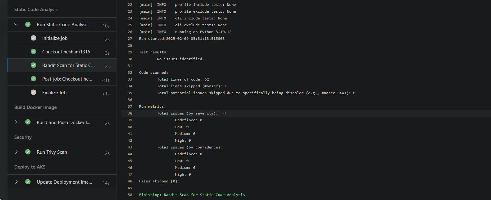
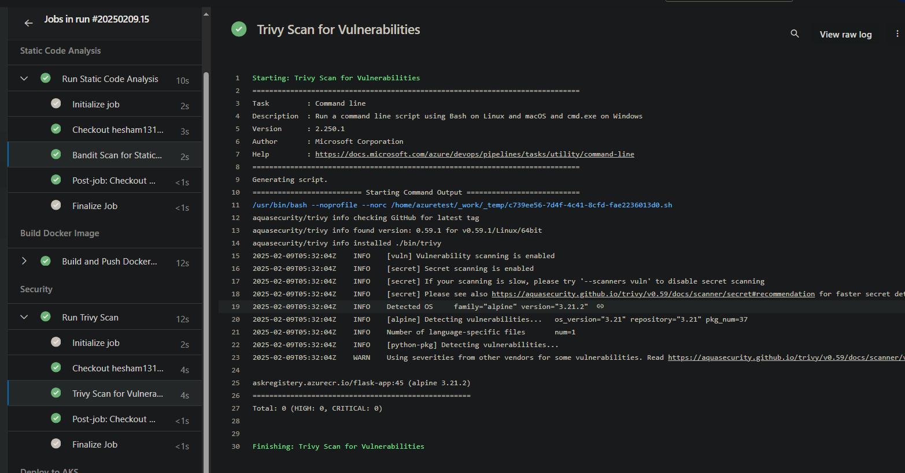
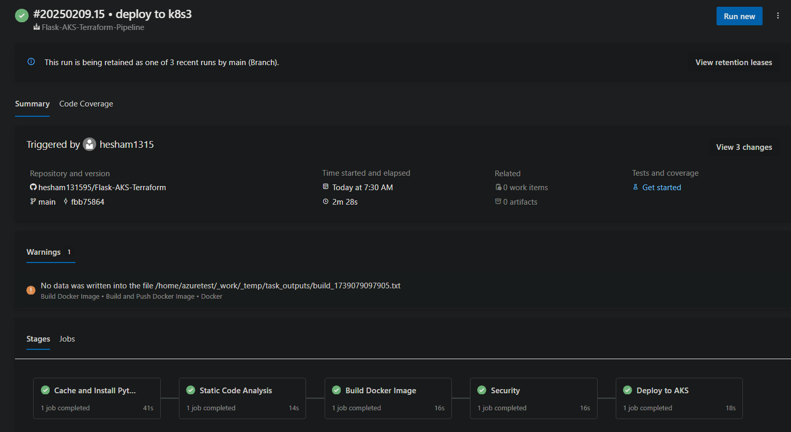

# Flask-AKS-Terraform
Deploy Flask application on Azure Kubernetes Service (AKS) using Terraform and Azure DevOps

## Architecture
- Flask microservices application
- Azure Kubernetes Service (AKS)
- Azure Container Registry (ACR) for images
- Terraform for Infrastructure as Code
- Azure DevOps for CI/CD pipeline

## Prerequisites
- Azure subscription
- Azure CLI
- Terraform >= 1.0
- kubectl
- Docker
- Git

# Setup Guide

## Azure AKS Terraform

### Azure Authentication Setup

1. Login to Azure CLI:
    ```bash
    # login to azure
    az login
    - open the output link and select your account
    ```
    > **Note:** A browser window will open. Sign in with your Azure credentials.

2. Verify Authentication
    ```bash
    az account show
    ```

3. Configure Subscription
    ```bash
    # List subscriptions
    az account list --output table

    # Set subscription
    az account set --subscription="SUBSCRIPTION_ID"

    # Verify selection
    az account show --output table
    ```
    > **Note:**: Replace SUBSCRIPTION_ID with your actual Azure subscription ID

### Terraform Backend Configuration

1. Create Resource Group
    ```bash
    export RG_NAME="terraform-state-rg"
    export LOCATION="eastus"
    # create resource group for terraform state files
    az group create --name $RG_NAME --location $LOCATION
   ```
2. Create storage account
   ```bash
   # create storage account
    az storage account create \
        --name tfstate$RANDOM \
        --resource-group terraform-state-rg \
        --sku Standard_LRS
    ```

3. Create container
    ```bash
    # Create storage container
    az storage container create \
        --name tfstate \
        --account-name <storage-account-name>
    ```

### Create SSH Public Key for Linux VMs

1. SSH Configuration
    ```bash
    # Create Folder
    mkdir $HOME/.ssh/aks-keys

    # Create SSH Key
    ssh-keygen \
        -m PEM \
        -t rsa \
        -b 4096 \
        -C "azureuser@myserver" \
        -f ~/.ssh/aks-keys/cluster-key \
        -N <your passphrse>
    ```

### Deploy AKS using Terraform 

1. Add your specific values 

    ```bash
    
    cd Terraform
    - Update the backend part in provider.tf file with values from previous step 
    - update terraform.tfvars file with your specific values
    ```
2. Deploy AKS cluster

    ``` bash
    terraform init
    terraform plan
    terraform apply --auto-approve
    ```
3. Validation
    ```bash 
    # Verify AKS cluster
    az aks get-credentials --resource-group ${RG_NAME} --name ${cluster_name}

    # Test connectivity
    kubectl get nodes
    kubectl get pods
    ```

### Build and push the image to ACR

1. Create ACR from azure portal 
    ```bash
    - login to container registeres services
    - create your registery
    ```
2. build your image
    ``` bash
    cd microservices
    # build the image 
    docker build -t flask-app .
    # tag the image
    docker tag flask-app <acr-name>.azurecr.io/flask-app:latest
    # login to acr
    az acr login --name <acr-name>
    # push the image 
    docker push <acr-name>.azurecr.io/flask-app:latest
    ```

### deploy app deployment and service in aks 

1. Deployment

    ```bash 
    cd app-deployment
    # create specific namespace
    kubectl create flask-app
    # deploy app-deplyment
    kubectl apply -f app-deployment.yaml
    # deploy the loadbalancer service
    kubectl apply -f service.yaml
    ```
2. Validation
    ```bash
    kubectl get pods -n flask-app
    kubectl get svc -n flask-app
    ```
3. Accessing app

    ```bash 
    - Get the loadbalancer ip from previous step
    - Access browser with the below urls
        http://{loadbalancer-ip}/users
        http://{loadbalancer-ip}/products
    ```

## Azure DevOps CI/CD Setup

### Organization & Project Setup 

1. Project configuration

    ```bash 
    - Navigate to [Azure DevOps](https://dev.azure.com)
    - Create Organization
    - Create Project
    ```

2. ACR Service connection configuration

   ```bash
   - Project Settings > Service Connections > New
   - Select: "Docker Registry"
   - Choose: "Azure Container Registry"
   - Authentication: Workload Identity Federation
   - Select subscription and registry
   - Name: `acr-connection`
   - ✓ Grant access to all pipelines
   - Save and copy service connection ID

3. Assign ACR Permissions:

    ```bash
    - Access App registeration and found the service connection ID
    - Copy the ID of app
    # Set variables
    ACR_NAME="your-registry-name"
    APP_ID="app_id"

    # Assign AcrPush role
    az role assignment create \
    --assignee <APP_ID> \
    --scope "/subscriptions/$SUBSCRIPTION_ID/resourceGroups/$RG_NAME/providers/Microsoft.ContainerRegistry/registries/$ACR_NAME" \
    --role "AcrPush"

    # Assign AcrPull role
    az role assignment create \
    --assignee <APP_ID> \
    --scope "/subscriptions/$SUBSCRIPTION_ID/resourceGroups/$RG_NAME/providers/Microsoft.ContainerRegistry/registries/$ACR_NAME" \
    --role "AcrPull"
    ```

 4. AKS Service connection configuration

    ```bash
    - Project Settings > Service Connections > New
    - Select: "Azure Resource Manager"
    - leave the default values
    - select Resource group
    - Name: `aks-connection`
    - ✓ Grant access to all pipelines
    - Save and copy service connection ID
    ```

5. Assign AKS Permissions:

    ```bash
    - Access App registeration and found the service connection ID
    - Copy the ID of app
    # Set variables
    ACR_NAME="your-registry-name"
    APP_ID="app_id"

    # assign acr pull to aks 
    az role assignment create \
    --assignee <APP_ID> \
    --scope "/subscriptions/$SUBSCRIPTION_ID/resourceGroups/$RG_NAME/providers/Microsoft.ContainerRegistry/registries/$ACR_NAME" \
    --role "AcrPull"


### Pipeline creation

1. create your first pipeline

    ```bash
    # access azure-pipelines.yml and update your specific values
    - Pipelines > New Pipeline
    - Select GitHub
    - Select Repository
    - Configure Pipeline:
    - Select Existing Azure Pipelines YAML file
    - Path: azure-pipelines.yml
    - Save and run
    ```

2. Results: 

- Static code analysis results 

    

- Trivy scan results 

    

- Pipeline results 

    

    


### Contributing
```bash
- Fork repository
- Create feature branch
- Submit pull request
```
### Cleanup
```bash
- terraform destroy
- az group delete --name aks-rg
```

